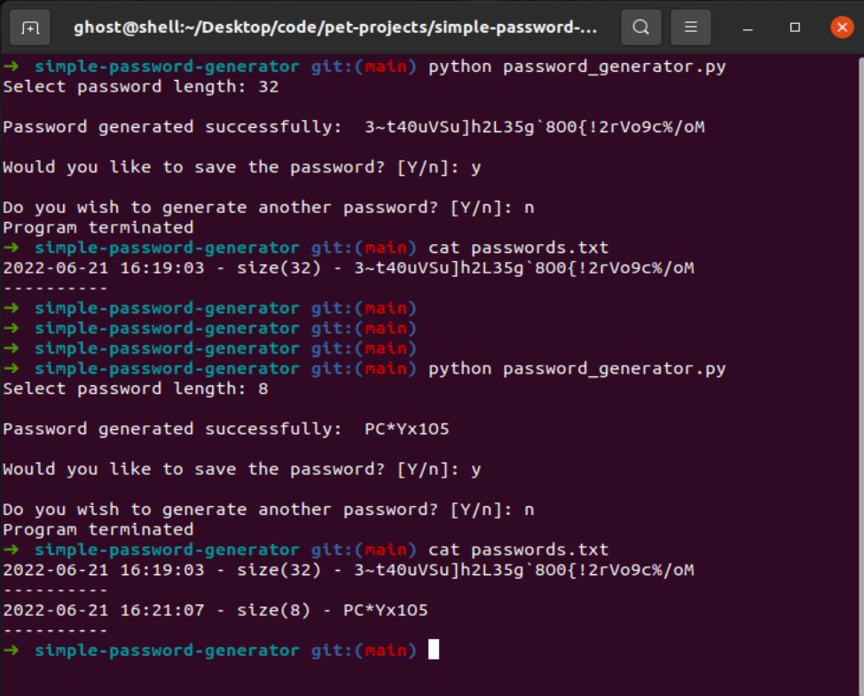

## Description

This little script will generate a complex password of given length 
with a random mix of numbers, capital and lowercase letters and special symbols. 
If you choose to save the password it will create a file called "passwords.txt" 
in the same directory where the script is located. Make sure it's a secure location. 
And ofcourse you can modify it any way that suits your needs.  
__It goes without saying the passwords.txt file must be closed when the script is ran.__
#
#### Below is a simple snippet of the script in action 

